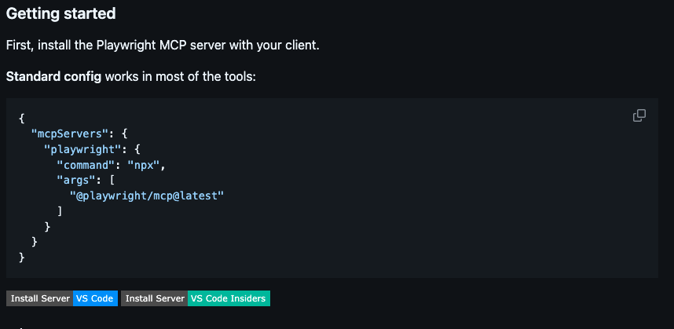
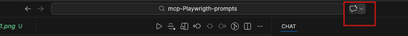
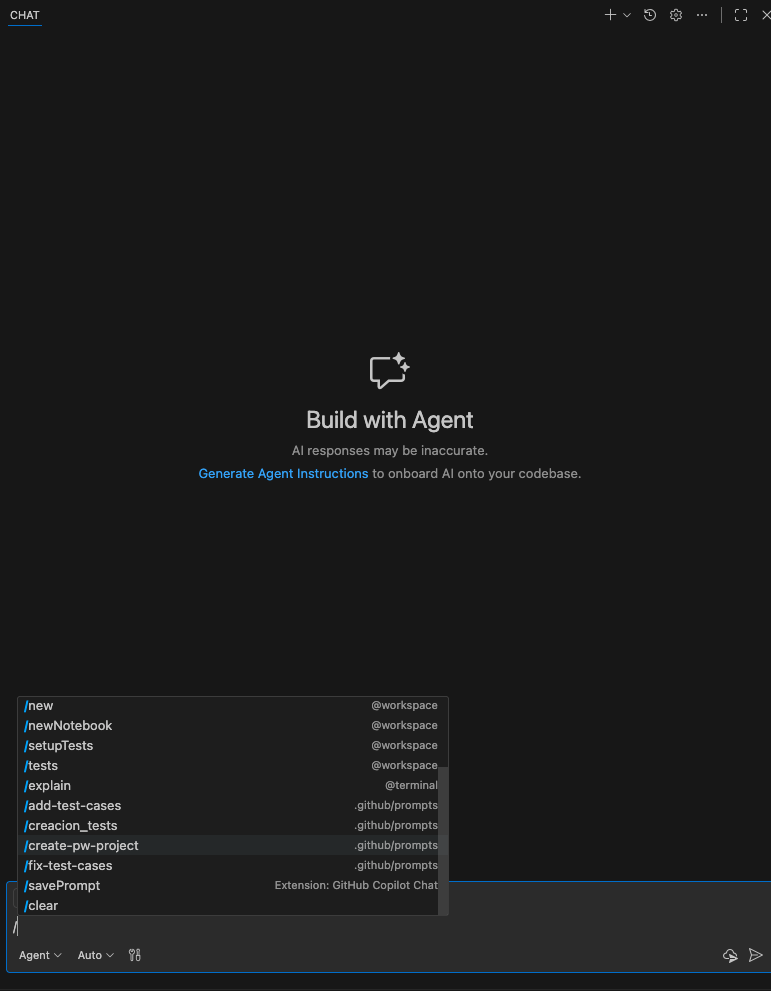

# MCP Playwright Prompts - GitHub Copilot Integration

Este repositorio proporciona **prompts personalizados**, **instrucciones**, y **configuración de chat** para integrar **GitHub Copilot** con **MCP de Playwright** (Model Context Protocol) para automatización de pruebas.

## 📋 Tabla de Contenidos

- [Descripción General](#descripción-general)
- [Estructura del Proyecto](#estructura-del-proyecto)
- [Configuración de GitHub Copilot](#configuración-de-github-copilot)
- [Instalación y Configuración](#instalación-y-configuración)
- [Cómo Usar Este Proyecto](#cómo-usar-este-proyecto)
- [Prompts Disponibles](#prompts-disponibles)
- [Casos de Prueba](#casos-de-prueba)
- [Ejecución de Pruebas](#ejecución-de-pruebas)
- [Cómo Colaborar](#cómo-colaborar)

## 🎯 Descripción General

Este proyecto es una **plantilla MCP para Playwright** que demuestra:

- ✅ Integración de **GitHub Copilot** con **MCP de Playwright**
- ✅ Generación automatizada de **test cases** desde CSV
- ✅ Estructura **Page Object Model (POM)** completa
- ✅ Prompts reutilizables para tareas comunes de testing
- ✅ Chat modes para facilitar el desarrollo de tests
- ✅ Seguimiento de **best practices** de Playwright

## 📁 Estructura del Proyecto

```
mcp-Playwrigth-prompts/
├── .github/
│   ├── chat/
│   │   └── playwright-tester.chatmode.md          # Configuración de chat mode para Playwright
│   ├── instructions/
│   │   └── playwrigth.instructions.md             # Guía de escritura de tests (best practices)
│   └── prompts/
│       ├── create-pw-project.prompt.md            # Inicializar proyecto Playwright
│       ├── add-test-cases.prompt.md               # Generar test cases desde CSV
│       ├── fix-test-cases.prompt.md               # Arreglar tests existentes
│       └── creacion_tests.prompt.md               # Generación de suite de tests
├── pages/                                         # Page Object Models
├── tests/                                         # Test specifications
├── data/
│   └── cases.csv                                  # Definiciones de test cases
├── playwright.config.js                           # Configuración de Playwright
├── .eslintrc.js                                   # Configuración ESLint
├── .env                                           # Variables de entorno (no versionado)
├── package.json                                   # Dependencias del proyecto
└── README.md                                      # Este archivo
```

## 🤖 Configuración de GitHub Copilot

Para usar **GitHub Copilot** con **MCP de Playwright**, sigue estos pasos:

### 1. **Instalar la Extensión de GitHub Copilot**

En VS Code:
1. Ve a Extensions (Ctrl+Shift+X / Cmd+Shift+X)
2. Busca "GitHub Copilot" y activalo en tu cuenta de Github
3. Instala la extensión oficial.
4. Autentica con tu cuenta de GitHub

### 2. **Configurar el MCP**

1. Ve al repo oficial de [MCP de playwrigth](https://github.com/microsoft/playwright-mcp)
2. Ve a la instalcion de VSC y click en el boton de instalar VSC



3. Y esta listo para usar desde la parte superior de VSC, recuerda siempre usar el MCp en modo agente 


### 3. **Usar Prompts con Copilot**

Los prompts disponibles en `.github/prompts/` están diseñados para ser usados con Copilot:

1. Abre un archivo `.prompt.md`
2. Copiar el contenido
3. Paste en la ventana de Copilot Chat (Ctrl+Shift+I / Cmd+Shift+I)
4. Copilot utilizará el contexto y generará el código automáticamente
5. Desde el chat como se muestra en la imagen

### 4. **Chat Modes**

El archivo `.github/chat/playwright-tester.chatmode.md` define el comportamiento del chat mode para testing:

- **Modo**: agent
- **Herramientas**: playwright, search, runTests, problems
- **Modelo**: GPT-4.1
- **Responsabilidades**: Planificación, exploración, desarrollo, ejecución y documentación de tests

## 🚀 Instalación y Configuración

### Requisitos Previos

- **Node.js** 16.0+
- **npm** 7.0+
- **GitHub Copilot** extension instalada en VS Code

### Pasos de Instalación 

1. **Desde el repositorio:**
   ```bash
   git clone https://github.com/RocioCruzS/mcp-Playwrigth-prompts.git
   cd mcp-Playwrigth-prompts
   ```

2. **Instalar dependencias:**
   ```bash
   npm install
   ```


## 📖 Cómo Usar Este Proyecto

### Flujo Recomendado

1. **Revisar Instrucciones:**
   - Lee `.github/instructions/playwrigth.instructions.md` para entender los estándares de código

2. **Usar Prompts con Copilot:**
   - Abre un prompt desde `.github/prompts/`
   - Copia y pega el contenido en Copilot Chat
   - Sigue las instrucciones generadas

3. **Ejecutar y Validar Tests:**
   ```bash
   npx playwright test
   ```

4. **Ver Reportes:**
   ```bash
   npx playwright show-report
   ```

## 📝 Prompts Disponibles

### 1. **`create-pw-project.prompt.md`**
Inicializa un proyecto Playwright desde cero con:
- Estructura POM completa
- Configuración de `.env`
- Dependencias necesarias
- Configuración de ESLint

**Uso:** Para crear un nuevo proyecto Playwright con best practices.

### 2. **`add-test-cases.prompt.md`**
Genera test cases desde definiciones en CSV con:
- Reutilización de Page Objects existentes
- Grouping por características
- Assertions automáticas

**Uso:** Para agregar nuevos tests basados en requirements en CSV.

### 3. **`creacion_tests.prompt.md`**
Genera una suite completa de tests:
- Parse del CSV
- Generación de test file
- Traducción de pasos y assertions

**Uso:** Para generar todos los tests de un CSV en una sola operación.

### 4. **`fix-test-cases.prompt.md`**
Arregla tests existentes:
- Análisis de fallos
- Actualización de locators
- Verificación de código

**Uso:** Para reparar tests que están fallando.

## 📊 Casos de Prueba

Los casos de prueba están definidos en `data/cases.csv` y cubren:

| ID | Caso | Descripción |
|----|------|-------------|
| 1 | User Login | Login con credenciales válidas |
| 2 | Access Product Detail | Navegar a detalle de producto |
| 3 | Add Product to Cart | Agregar productos al carrito |
| 4 | Checkout Workflow | Completar proceso de compra |
| 5 | Logout | Cerrar sesión |

## 🧪 Ejecución de Pruebas

### Comandos Básicos

```bash
# Ejecutar todos los tests
npx playwright test

# Ejecutar en modo headless deshabilitado (interactivo)
npx playwright test --headed

# Ejecutar un archivo específico
npx playwright test tests/login.spec.js

# Ejecutar con debugging
npx playwright test --debug

# Ver reporte de resultados
npx playwright show-report
```

## 🤝 Cómo Colaborar

¡Las contribuciones son bienvenidas! Para colaborar:

1. **Fork este repositorio:**
   ```bash
   git clone https://github.com/RocioCruzS/mcp-Playwrigth-prompts.git
   cd mcp-Playwrigth-prompts
   ```

2. **Crear una rama para tu feature:**
   ```bash
   git checkout -b feature/mi-feature
   ```

3. **Hacer cambios y commit:**
   ```bash
   git add .
   git commit -m "feat: descripción de cambios"
   ```

4. **Push a tu fork:**
   ```bash
   git push origin feature/mi-feature
   ```

5. **Abrir un Pull Request** en GitHub

### Estándares de Contribución

- Sigue las guías en `.github/instructions/playwrigth.instructions.md`
- Usa los prompts en `.github/prompts/` como referencia
- Asegúrate que todos los tests pasen: `npx playwright test`
- Verifica que el código cumple ESLint: `npm run lint`

## 📚 Recursos Adicionales

- [Documentación de Playwright](https://playwright.dev/)
- [GitHub Copilot Documentation](https://github.com/features/copilot)
- [MCP Protocol Documentation](https://modelcontextprotocol.io/)
- [Sauce Labs Demo App](https://www.saucedemo.com/)
- [Airbnb JavaScript Style Guide](https://github.com/airbnb/javascript)

## 📄 Licencia

Este proyecto es mantenido por [RocioCruzS](https://github.com/RocioCruzS).

---

**Última actualización:** November 20, 2025

---

